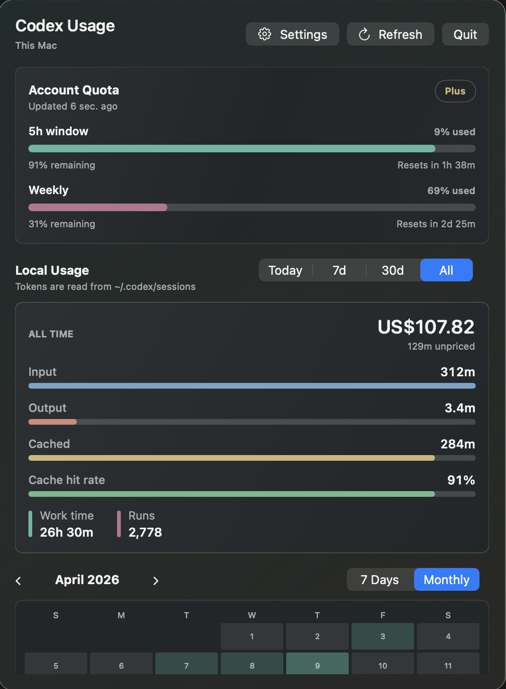
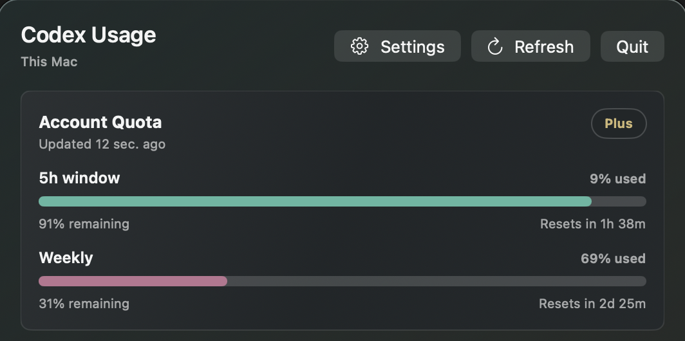
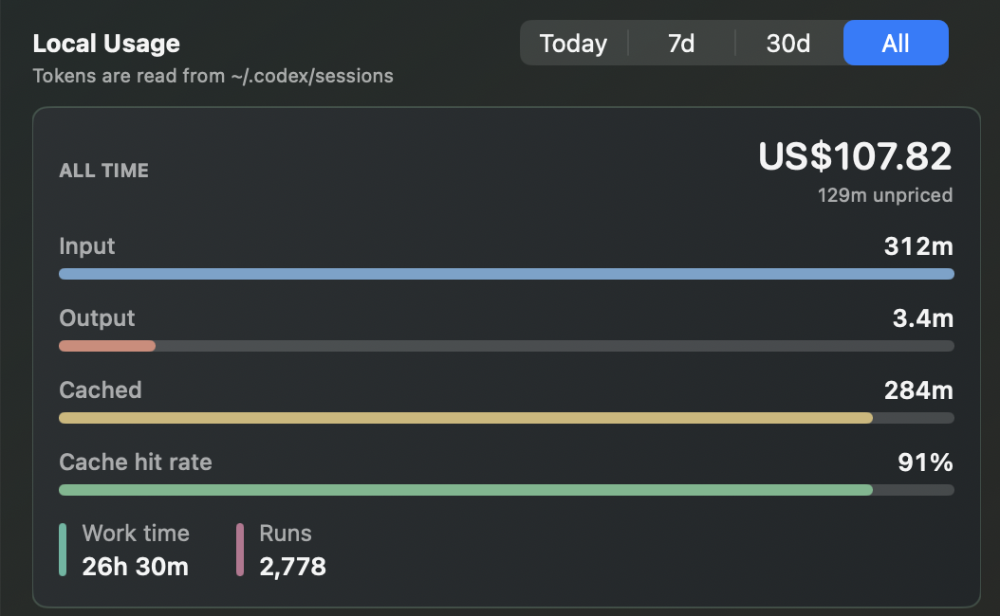
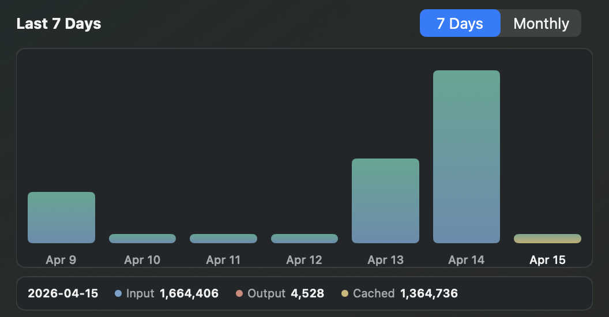
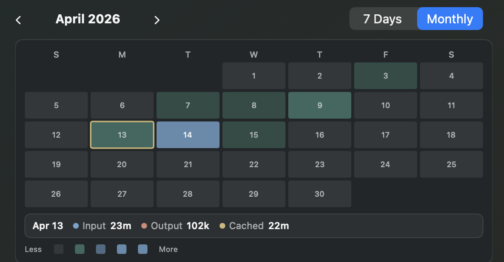
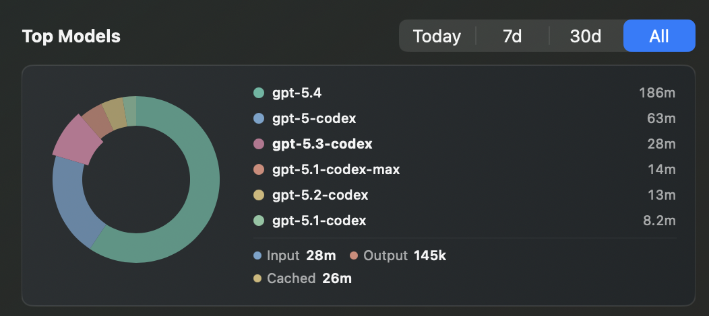

# CodexUsageBar Codex 用量插件

A local-only macOS menu bar monitor for Codex usage.

The first version reads `~/.codex` on this Mac and does not upload prompts,
session text, or raw logs. Account quota is shown from the latest rate-limit
snapshot found in local Codex session events.

This project is unofficial and is not affiliated with OpenAI.

## Screenshots

### Overview



### Account Quota



### Local Usage



### Usage Charts





### Top Models



## Privacy

- Reads local session data from `~/.codex` on this Mac only
- Does not upload prompts, transcripts, or raw session logs
- Shows quota and reset data only when those snapshots exist in local Codex events

## Run

```sh
swift run CodexUsageBar
```

## Package

```sh
scripts/package-app.sh
open dist/CodexUsageBar.app
```

## Test

```sh
swift run CodexUsageSmokeTest
```

## Current Scope

- This Mac usage only
- Today, last 7 days, last 30 days, and all-time token summaries
- Input, cached input, output, cache hit rate, runs, sessions, and active time
- Latest known account quota/reset snapshot from local Codex logs
- API-equivalent cost estimate for known GPT-5.4 model prices

## Publish

```sh
git init
git add .
git commit -m "Initial public release"
```
